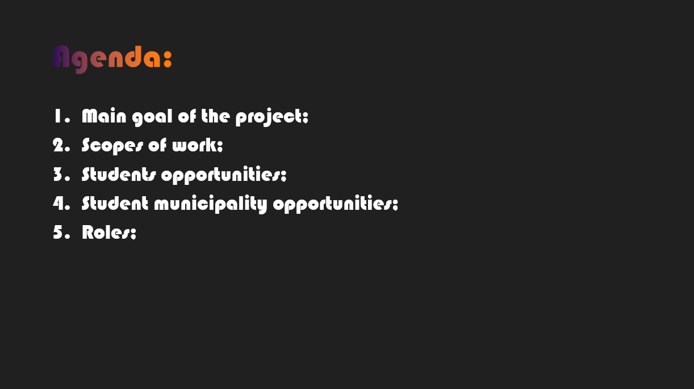
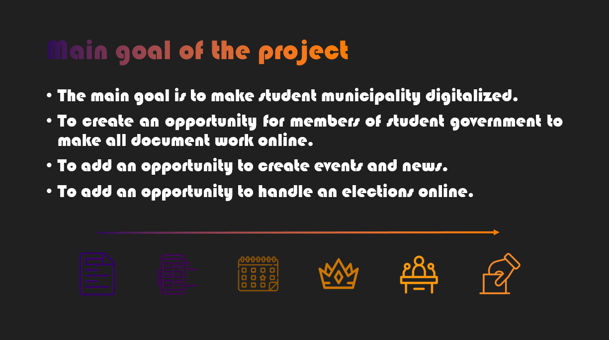
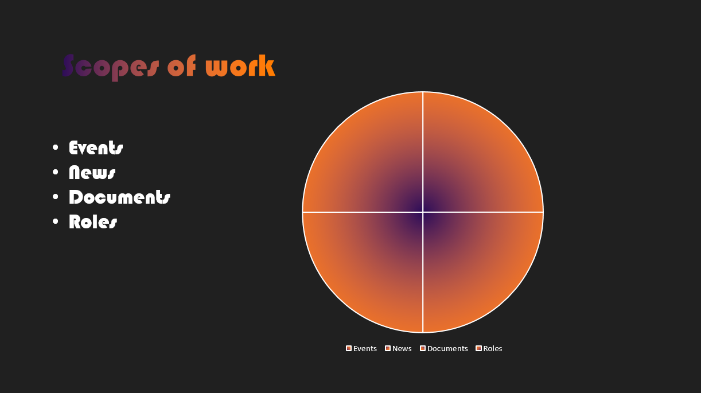
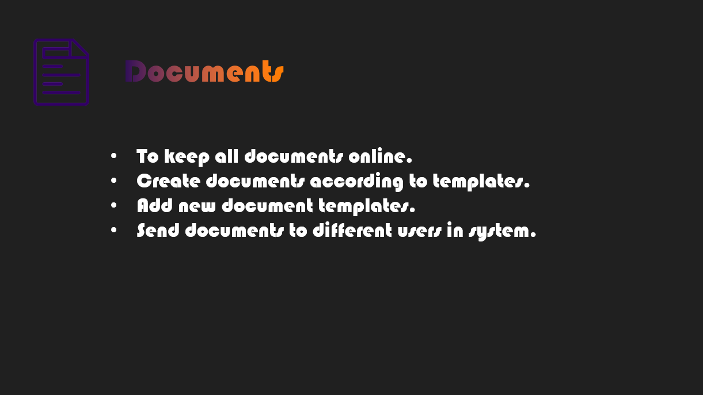
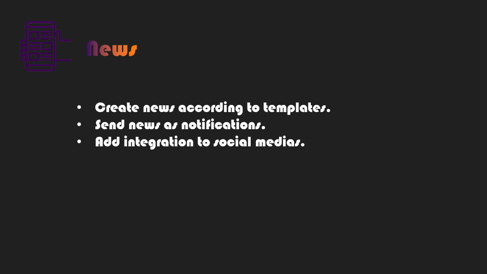
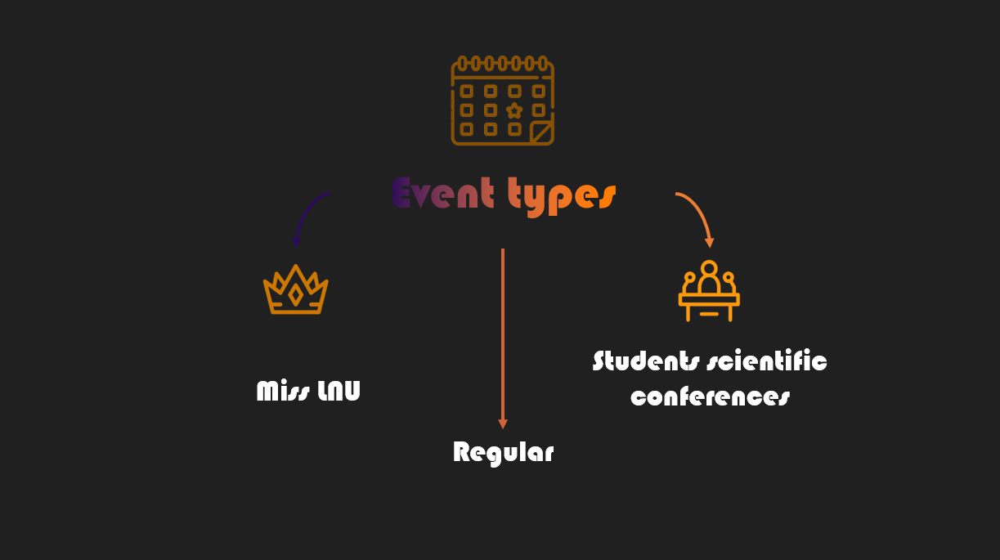
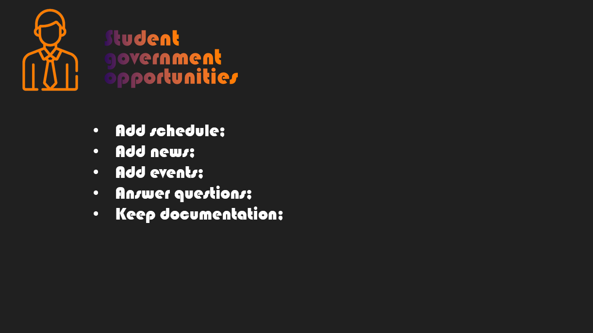
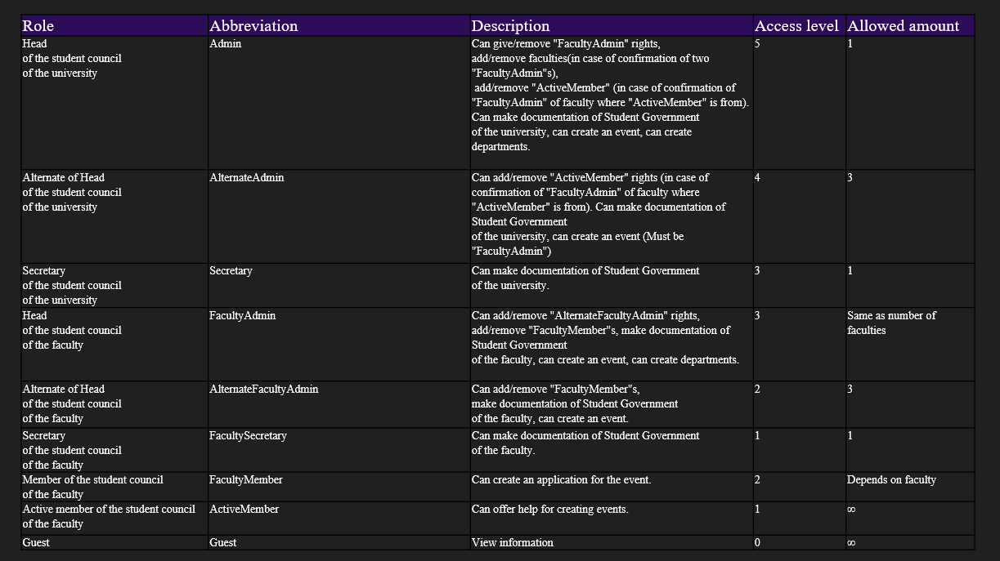

## How to start the project locally.
1. Clone or download the project from https://github.com/oldorkestr/SuLnu.git

2. Install ASP.NET Core Runtime 3.1.0

3. Install Microsoft SQL Server 2014+

4. Create local database from EPlast.DataAccess migrations.

(Open Package Manager Console, change default project to "SuLnu.DataAccess" and write "Update-Database")
